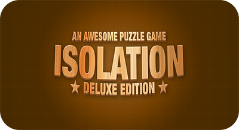

## About
Isolation is a slide puzzle game developed in WPF as a school assignment. The main purpose of the assignment was to get familiar with low level bitmap manipulations, as well as generating guassian blurs.

No 3rd party libraries were allowed. The only 3rd party library used in this project is [AvCapWPF](https://github.com/sam-lippert/AvCapWpf) for webcam support.

The pieces in the slide puzzle all had to be drawn on one view. Meaning the animations for the sliding is done manually frame by frame.

A paper written for this project can be read [here](https://silverfox.be/files/isolation-paper.pdf) with a full explanation.

## PuzzleGameLibrary
PuzzleGameLibrary is a comprehensive library for bitmap loading and manipulation which does the heavy lifting for this project. It supports the following operations:

* Flip horizontally
* Flip vertically
* Translate horizontally
* Invert
* Greyscale
* Sepia
* Guassian blur
* Fast gaussian blur (using two motion blurs)
* Horizontal motion blur
* Vertical motion blur

### Image formats supported
* JPG, PNG and BMP (for reading pixel info)
* JPG and PNG for metadata (read/write)
* 24 and 32 bit

## Controls
You can slide the tiles by clicking them, or by using the arrow keys.

## Project build with
Visual Studio Ultimate 2012  
on Windows 8.1

### Please note
This project does not utilize GPU acceleration since this was out of scope for the assignment. The project mainly serves as an example for advanced bitmap manipulation.

## License

This project is available under the MIT license. See the LICENSE file for more info.